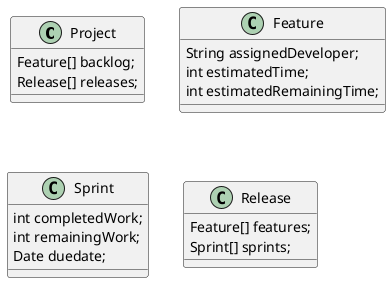

# MPP Course

## lab1 class diagram (no method, no associations)

```plantuml

@startuml
class Project {
    Feature[] backlog;
    Release[] releases;
}

class Feature {
    String assignedDeveloper;
    int estimatedTime;
    int estimatedRemainingTime;
}

class Sprint {
    int completedWork;
    int remainingWork;
    Date duedate;
}

class Release {
    Feature[] features;
    Sprint[] sprints;
}

@enduml
```
