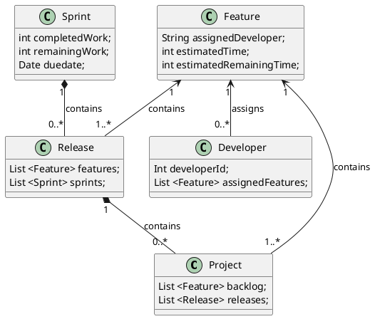

# MPP Course

## lab2 class diagram

```plantuml

@startuml

class Project {
    List <Feature> backlog;
    List <Release> releases;
}

class Feature {
    String assignedDeveloper;
    int estimatedTime;
    int estimatedRemainingTime;
}

class Sprint {
    int completedWork;
    int remainingWork;
    Date duedate;
}

class Release {
    List <Feature> features;
    List <Sprint> sprints;
}

class Developer {
    Int developerId;
    List <Feature> assignedFeatures;
}

Feature "1" <-- "1..*"  Project : contains
Release "1" *-- "0..*"  Project : contains
Feature "1" <-- "1..*"  Release : contains
Feature "1" <-- "0..*"  Developer : assigns
Sprint "1" *-- "0..*"  Release : contains


@enduml
```
