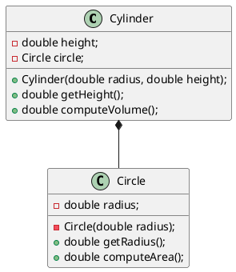

# Lab3

## Prob3

1. Using inheritance does not make sense if we use cylinder as a parent class. But if we use circle as a parent it is much more meaningful. On the UML diagram circle inherited only using the radius nothing else.

2. Revision with composition

