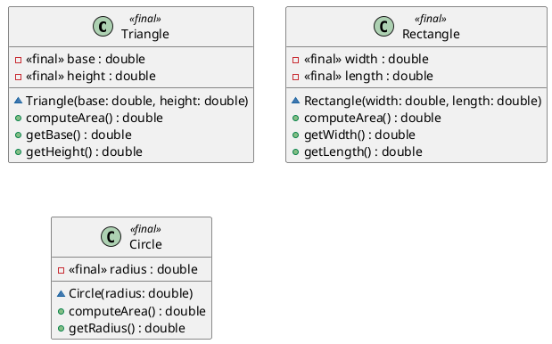

# Lab 5

## prob 3

```plantuml
@startuml
class Triangle <<final>>{
    - <<final>> base : double
    - <<final>> height : double
    ~ Triangle(base: double, height: double)
    + computeArea() : double
    + getBase() : double
    + getHeight() : double
}

class Rectangle <<final>>{
    - <<final>> width : double
    - <<final>> length : double
    ~ Rectangle(width: double, length: double)
    + computeArea() : double
    + getWidth() : double
    + getLength() : double
}

class Circle <<final>>{
    - <<final>> radius : double
    ~ Circle(radius: double)
    + computeArea() : double
    + getRadius() : double
}

@enduml
```
